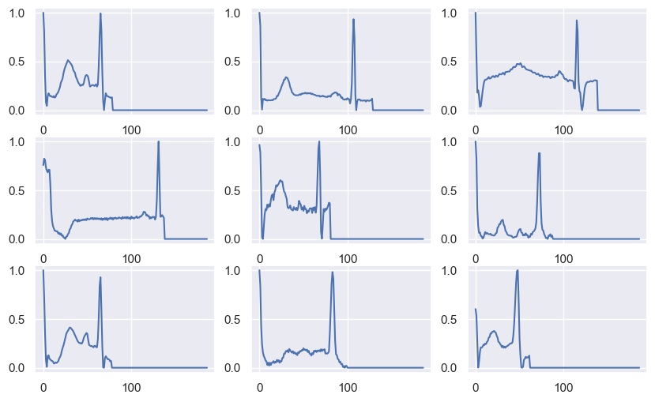

# Cardiac Arrhythmia Classification

A deep neural network classification model to classify electrocardiogram (EKG) signals
into one of 5 categories:

- **N**: Normal beat
- **S**: Supraventricular premature beat
- **V**: Premature ventricular contraction
- **F**: Fusion of ventricular and normal beat
- **Q**: Unclassifiable beat

The best performing model implementation achieves an F-1 score of 0.97.

<p align="left">

</p>

## Prerequisites

- Python 3.11+
- [UV](https://docs.astral.sh/uv/) package manager
- Docker and Docker Compose (for local Spark)
- Terraform 1.0+ (for GCP deployment)
- gcloud CLI (for GCP deployment)

## Installation

```bash
# install dependencies
make install

# install with dev dependencies
make dev-install

# set up pre-commit hooks
uv run pre-commit install
```

## Configuration

Copy the example environment file and configure your settings:

```bash
cp .env.example .env
```

Key environment variables:

| Variable | Description | Default |
|----------|-------------|---------|
| `DATA_DIR` | Directory containing data files | `data` |
| `GCP_PROJECT_ID` | GCP project ID | (required for GCP) |
| `GCP_BUCKET_NAME` | GCS bucket name | (required for GCP) |
| `MODEL_HIDDEN_LAYERS` | MLP hidden layer sizes | `75,75,75` |
| `MODEL_BALANCE_CLASSES` | Balance classes during training | `true` |

See `.env.example` for all available options.

## Local Training

### Using scikit-learn

```bash
# train with default settings
make train-local

# or run directly with options
uv run python -m app.cli.train --backend sklearn --balance-classes
```

### Using PySpark (local cluster)

```bash
# start local Spark cluster
make docker-up

# train with Spark
make train-spark

# stop cluster
make docker-down
```

## GCP Deployment

### Infrastructure Setup with Terraform

```bash
# initialize terraform
make tf-init

# validate configuration
make tf-validate

# preview changes
cd terraform && terraform plan -var-file=environments/dev.tfvars

# apply changes
cd terraform && terraform apply -var-file=environments/dev.tfvars
```

### Data Pipeline

```bash
# set up GCP resources and upload data
uv run python -m app.cli.gcp_setup setup

# or step by step:
uv run python -m app.cli.gcp_setup validate
uv run python -m app.cli.gcp_setup upload
uv run python -m app.cli.gcp_setup load-bigquery
```

## Development

### Running Tests

```bash
# run all tests
make test

# run with verbose output
uv run pytest -v

# run specific test file
uv run pytest tests/unit/test_models.py
```

### Code Quality

```bash
# lint code
make lint

# format code
make format

# type check
make type-check
```

## Project Structure

```
ekg-classifier/
├── app/                    # Application layer
│   ├── cli/               # Command-line interfaces
│   │   ├── train.py       # Training CLI
│   │   └── gcp_setup.py   # GCP setup CLI
│   └── services/          # Business logic
│       ├── training_service.py
│       └── gcp_service.py
├── libs/                   # Reusable libraries
│   ├── data/              # Data loading and preprocessing
│   ├── ml/                # ML trainers and evaluation
│   └── gcp/               # GCP client wrappers
├── terraform/             # Infrastructure as code
│   ├── modules/           # Terraform modules
│   └── environments/      # Environment-specific configs
├── tests/                 # Test suite
├── local/                 # Jupyter notebooks for exploration
├── data/                  # Training and test data
├── config.py              # Pydantic settings
├── models.py              # Pydantic models
└── protocols.py           # Protocol definitions
```

## Implementations

### Local

- `local/EKG_nn.ipynb` - Jupyter notebook with scikit-learn MLP
- `local/EKG_nn_pyspark.ipynb` - Jupyter notebook with local PySpark

### Cloud

- `app/cli/train.py` - CLI for training with sklearn or Spark backends
- `terraform/` - Infrastructure for GCP Dataproc deployment

## Dataset

The model uses the MIT-BIH Arrhythmia Database, preprocessed and split into:

- `data/mitbih_train.csv.gz` - 87,554 training samples
- `data/mitbih_test.csv.gz` - 21,892 test samples

Each sample contains 187 features (EKG signal values) and 1 label column.

## License

MIT
